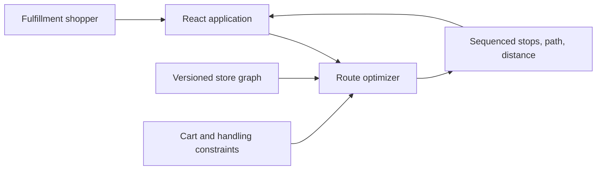
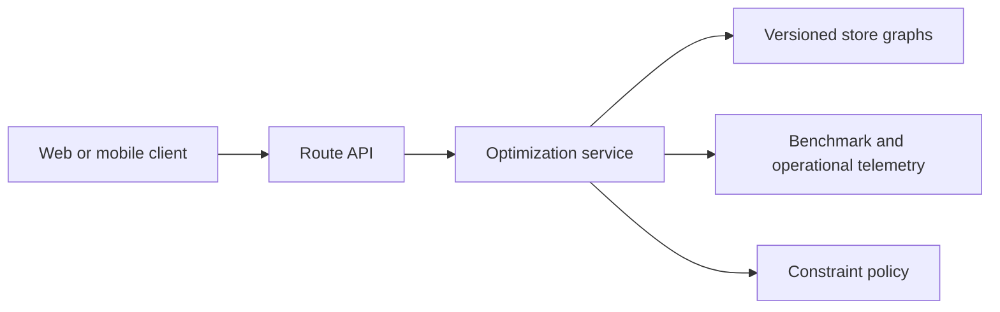

# RouteWise Architecture

## Purpose

RouteWise evaluates whether constraint-aware routing can reduce in-store
walking distance relative to common list-ordering approaches. The current
architecture favors transparent, testable optimization behavior over premature
backend complexity.

## Current system context

The current application is a client-side vertical slice. No external retailer
API, live indoor location, authentication, or persistence is claimed.

## Domain model

- **Store:** Identifies the graph, entrance, checkout, and map scale.
- **Store node:** Represents an entrance, checkout, intersection, or pick
  location.
- **Store edge:** Represents a walkable connection between two nodes.
- **Cart item:** Associates a product and handling constraint with a node.
- **Route result:** Contains ordered stops, expanded walkable path, and total
  distance.

## Optimization flow

1. Build a bidirectional weighted graph from store nodes and edges.
2. Convert map distances to feet using the store graph scale.
3. Separate ambient items from deferred chilled and frozen items.
4. Select the nearest remaining location for each group.
5. Connect each selected stop with Dijkstra shortest paths.
6. Compare the result with an aisle-order baseline.

## Current tradeoffs

| Choice | Benefit | Limitation |
| --- | --- | --- |
| Client-side optimizer | Simple, inspectable, fast iteration | Not suitable for governed enterprise deployment |
| Deterministic sample graph | Reproducible demonstration | Does not prove broad performance |
| Nearest-neighbor heuristic | Fast and easy to explain | Can produce suboptimal route sequences |
| Cold items deferred as a group | Demonstrates operational constraints | Does not model maximum exposure time |
| Distance-based estimate | Transparent primary metric | Does not capture congestion or item search time |

## Target architecture

The optimization module should remain independent from React. When operational
needs justify it, the module can move behind a versioned API with persisted
store graphs, benchmark telemetry, request tracing, and route-strategy
selection.

## Quality attributes

- **Correctness:** Every requested location is visited exactly once unless
  product-location rules explicitly allow otherwise.
- **Explainability:** Baselines, assumptions, and constraints remain visible.
- **Performance:** Route generation for carts up to 100 items targets less than
  500 ms.
- **Reproducibility:** Fixtures and benchmarks use deterministic seeds.
- **Maintainability:** Domain logic remains separate from UI state and styling.
- **Observability:** Future service boundaries must expose strategy, duration,
  graph version, constraint decisions, and failure reason.

## Testing strategy

Current tests verify core invariants on a deterministic fixture. Planned
coverage includes disconnected graphs, duplicate product locations, generated
carts, exact-solver comparisons, performance budgets, and dynamic rerouting.

## Security and privacy

The current version processes no personal data. A production system would need
to minimize location retention, authorize store-graph access, validate graph
and cart inputs, and avoid exposing proprietary retailer layout data.
