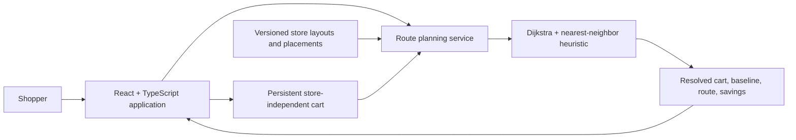

# RouteWise Case Study

## Executive summary

RouteWise is a production-minded proof of concept for store-specific,
constraint-aware shopping routes. It addresses the gap between knowing where
individual products are and knowing the efficient order in which to collect an
entire cart.

The application supports a store-first shopping journey: select a store,
search its catalog, manage a persistent cart, choose a shopping order, preview
the route, and complete a guided picking session.

- **Live application:** <https://route-wise-mocha.vercel.app/>
- **Source repository:** <https://github.com/ravi-rajpurohit-gh/route-wise>

## Problem

Retail applications commonly identify an item's aisle. That solves product
location, but it does not solve cart sequencing. A shopper can still
backtrack, cross the store repeatedly, or collect temperature-sensitive items
too early.

This matters most for delivery shoppers and fulfillment associates, where
avoidable walking directly affects order completion time and capacity. Regular
shoppers benefit from the same core capability.

## Product hypothesis

> A store-specific, constraint-aware route can reduce walking distance versus
> transparent list-ordering baselines without violating product-handling rules.

RouteWise does not claim live retailer integration or aisle-level indoor
positioning. The current proof of concept assumes a selected store, a known
entry and checkout, a versioned walkable layout, and product-placement data.

## Solution

RouteWise resolves a store-independent cart against the selected store, then
offers three shopping orders:

1. **Added order:** Preserve the shopper's original cart-entry sequence.
2. **Aisle order:** Sort by aisle labels.
3. **Recommended route:** Sequence nearby products while deferring chilled and
   frozen items.

The shopper can preview the store-specific route and follow a guided next-item
experience. Cart state, saved items, selected store, and preferred order
persist on the current device.

## Technical approach

Each store layout is represented as a weighted, undirected graph:

- Entrances, checkouts, intersections, and pick locations are nodes.
- Walkable segments are edges.
- Each layout defines a scale that converts map units to feet.
- Product placements associate products with one store layout and pick node.

Dijkstra's algorithm calculates shortest paths between route stops. The
recommended-route heuristic repeatedly selects the nearest remaining
non-deferred stop, then visits chilled and frozen stops later.

The current objective is:

```text
minimize Σ distance(stopᵢ, stopᵢ₊₁)
```

subject to entry, checkout, availability, and handling constraints.

## Architecture



The optimizer, repository contracts, cart resolution, pick session, and React
interface remain separate modules. This keeps the routing logic testable and
allows a future optimization service to replace the client-side planner.

## Product and engineering decisions

| Decision | Rationale |
| --- | --- |
| Store-first journey | Availability and aisle placement must be known before route planning. |
| One journey for regular and delivery shoppers | The core cart and guided-shopping needs overlap. |
| Transparent aisle-order baseline | Reviewers can understand and reproduce the comparison. |
| Versioned layouts and placements | Store maps and product positions change independently. |
| Local-device persistence | Useful without introducing accounts or cross-device complexity. |
| No price scope | Pricing does not strengthen the routing hypothesis. |
| Shopper-oriented map over graph model | The optimizer needs a graph; shoppers need recognizable departments and landmarks. |

## Current capabilities

- Three store layouts with distinct product placements
- Store-scoped availability and search
- Cart quantity, remove, clear, save-for-later, and restore actions
- Added-order, aisle-order, and recommended-route choices
- Guided picked and cannot-find workflow
- Current-device persistence
- Customer-friendly map with departments, aisles, landmarks, numbered stops,
  entry, checkout, and route legend
- In-application explanation of the problem, method, evidence, and limitations
- Automated lint, unit, integration, accessibility, responsive-contract, and
  production-build gates

## Verification

The current quality gate contains **34 automated tests across nine test
files**. Coverage includes:

- Route completeness, start/end behavior, distance scaling, and constraints
- Multi-store graph isolation and placement resolution
- Cart behavior and persistence
- Guided-shopping state transitions
- Store-first search and mobile shopping workflows
- Customer-friendly map landmarks and legend
- Automated serious/critical accessibility violation scan
- Responsive breakpoint, touch-target, and overflow contracts

The production runtime dependency audit reports zero known vulnerabilities.

## Evidence and limitations

The application compares the recommended route with an aisle-order baseline
for the selected store and cart. This is useful product evidence, but it is not
yet a broad algorithm-performance claim.

Current limitations:

- Store layouts and product placements are maintained fixtures.
- The nearest-neighbor heuristic is not guaranteed to be globally optimal.
- The application does not model congestion, product-search time, live
  inventory, substitutions, or indoor positioning.
- Automated accessibility scanning excludes color contrast because the current
  test environment does not calculate rendered colors reliably.
- Exact mobile, tablet, and desktop screenshot review remains a manual release
  activity until browser automation is restored.

## Production path

A retailer-ready implementation would require:

1. Authorized, versioned store-layout and product-location data.
2. A governed route API with input validation and observability.
3. Stronger optimization benchmarks, including 2-opt and exact small-cart
   comparisons.
4. Live availability, substitution, and operational-policy integrations.
5. User research and measured fulfillment-time experiments.
6. Privacy-conscious handling of location and shopping-session data.

## Next engineering milestones

- Benchmark generated carts across stores and cart sizes.
- Add a reusable distance matrix and 2-opt improvement.
- Compare small carts against an exact solver.
- Model substitutions, multiple entrances, and configurable constraints.
- Capture polished interface screenshots and publish measured benchmark
  results.
